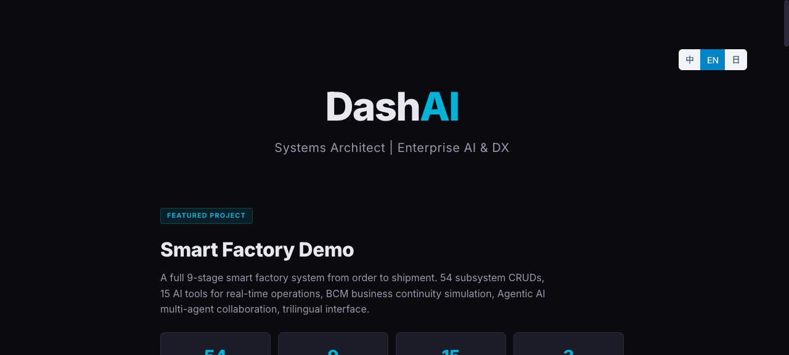
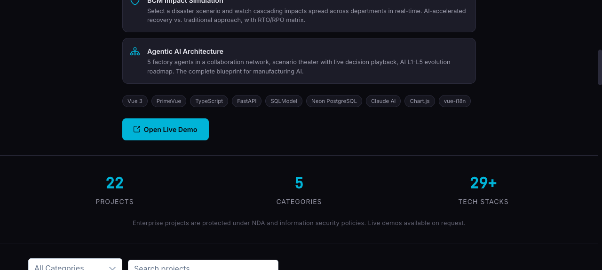

# DashAI Portfolio

**[https://portfolio.dashai.dev](https://portfolio.dashai.dev)**

Professional portfolio showcasing 26 projects across enterprise systems, AI security, trading, developer tools, and language learning.





## Features

- Trilingual UI (Traditional Chinese / English / Japanese) with auto-detection
- Category filtering and full-text search
- 33 technology tags with usage statistics
- Responsive dark theme (PrimeVue Aura)

## Tech Stack

| Layer | Technology |
|-------|-----------|
| Frontend | Vue 3 + TypeScript + PrimeVue 4 (Aura) |
| Build | Vite |
| Deployment | Vercel |

## Local Development

```bash
npm install
npm run dev
```

## License

MIT
